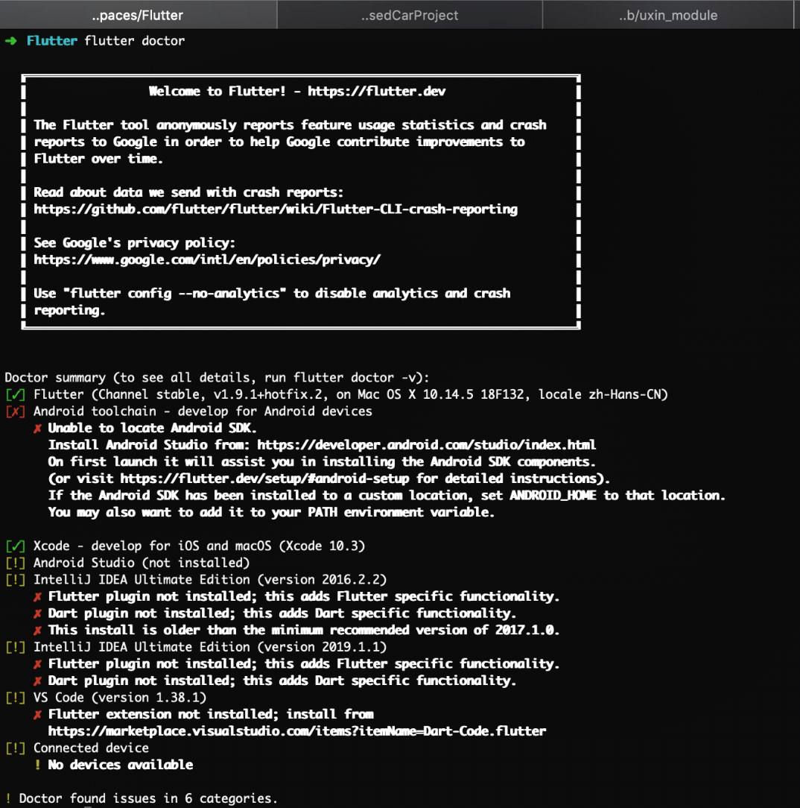
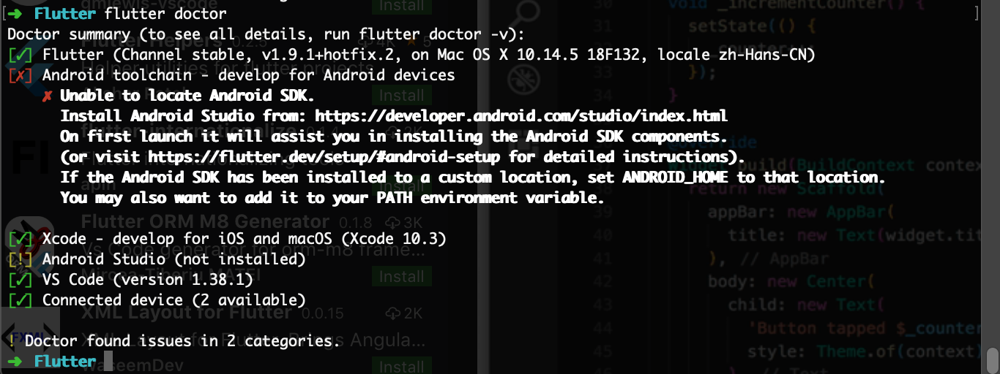
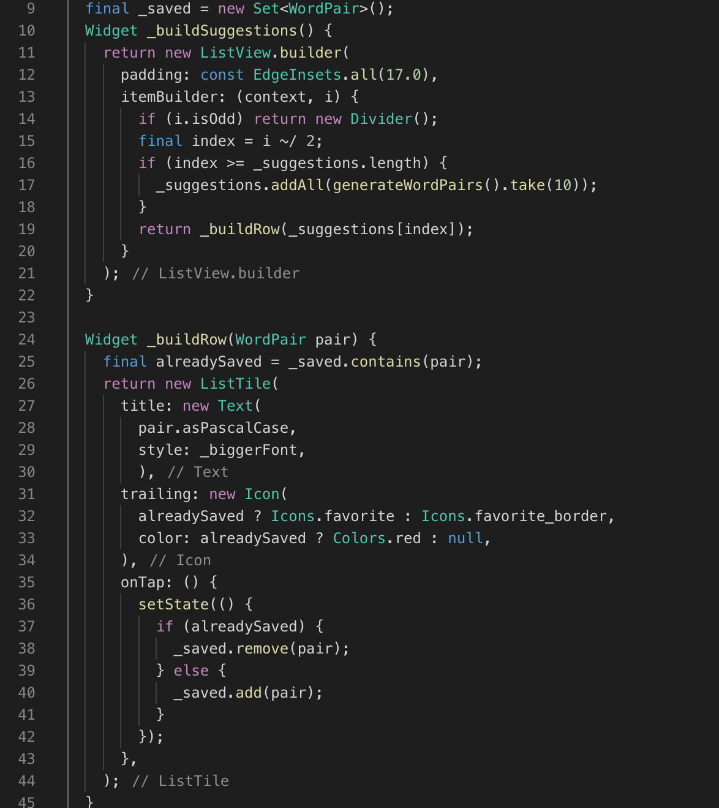
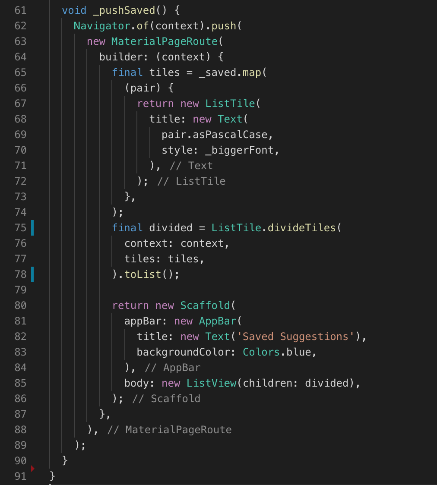

#Flutter

## 简介
谷歌推出的移动UI框架，可以快速在iOS和Android上构建高质量的原生用户界面。 

可以与现有的代码一起工作，进行混编。

在全世界，正在被越来越多的开发者和组织使用，免费、开源。

#### 搭建环境（macOS）

1. 使用镜像，Flutter官方为中国开发者搭建了临时镜像

	```
	export PUB_HOSTED_URL=https://pub.flutter-io.cn
	export FLUTTER_STORAGE_BASE_URL=https://storage.flutter-io.cn
	```

2. 获取Flutter SDK

	flutter官网下载，[链接](https://flutter.dev/docs/development/tools/sdk/releases?tab=macos#macos)

	或者flutter [github](https://github.com/flutter/flutter) 

3. 解压到安装目录

	```
	cd ~/development
	unzip ~/Downloads/flutter_macos_v1.9.1+hotfix.2-stable.zip 
	```

4. 添加flutter相关工具到path中：

	```
	export PATH=`pwd`/flutter/bin:$PATH
	```
	
5. 运行 flutter doctor ， 解决依赖问题

	
	
	仔细检查图上报告内容，按照提示解决问题。
	
	
	
6. 更新环境变量 到 bash文件

	```
	export PUB_HOSTED_URL=https://pub.flutter-io.cn
	export FLUTTER_STORAGE_BASE_URL=https://storage.flutter-io.cn
	export PATH=/Users/xielei/Workspaces/Flutter/flutter/bin:$PATH
	```
	
#### 创建应用

1. 使用vscode 输入命令 Flutter，选择 New Project，默认创建一个 Material APP

2. 使用三方库，通过 https://pub.dev/flutter 查找需要的三方库，如 english_words，添加到 pubspec.yaml 文件中

	```
	dependencies:
  flutter:
    sdk: flutter

  # The following adds the Cupertino Icons font to your application.
  # Use with the CupertinoIcons class for iOS style icons.
  cupertino_icons: ^0.1.2
  english_words: ^3.1.0
  
	```
	点击右上角获取package 或者输入命令 Flutter : Get Packages
	
	看到一下输出，提示安装成功
	
	```
	flutter packages get
Running "flutter packages get" in startup_namer...
Process finished with exit code 0
	```
	
	可以在文件中进行导入
	
	```
	import 'package:english_words/english_words.dart';
	```
	
3. 有状态部件

	部件分为无状态（stateless widgets）和有状态（stateful widgets）
	
	- 无状态（stateless widgets）部件是不可变的, 这意味着它们的属性不能改变 - 所有的值都是最终的.
	- 有状态（stateful widgets）部件持有的状态可能在widget生命周期中发生变化. 实现一个 stateful widget 至少需要两个类:
		1. 一个 StatefulWidget类。
		2. 一个 State类。 StatefulWidget类本身是不变的，但是 State类在widget生命周期中始终存在.
	
4. 添加状态部件

	stateful widget class
	
	```
	class RandomWords extends StatefulWidget {
  		@override
  		createState() => new RandomWordsState();
	}
	```
	
	state class
	
	```
	class RandomWordsState extends State<RandomWords> {
  		@override
	  	Widget build(BuildContext context) {
    		final wordPair = new WordPair.random();
    		return new Text(wordPair.asPascalCase);
  		}
	}
	```
5. 创建ListView
	
	ListView类提供了一个builder属性，itemBuilder 值是一个匿名回调函数， 接受两个参数- BuildContext和行迭代器i。迭代器从0开始， 每调用一次该函数，i就会自增1，对于每个建议的单词对都会执行一次。
	
	
	
6. 添加交互

	图上的 **trailing** 字段为交互结果；**onTap()** 为触发交互的行为；将需要修改行为的代码包裹在 **setState()** 方法内。
	
7. 添加路由

	在Flutter中，导航器管理应用程序的路由栈。将路由推入（push）到导航器的栈中，将会显示更新为该路由页面。 从导航器的栈中弹出（pop）路由，将显示返回到前一个路由。

	