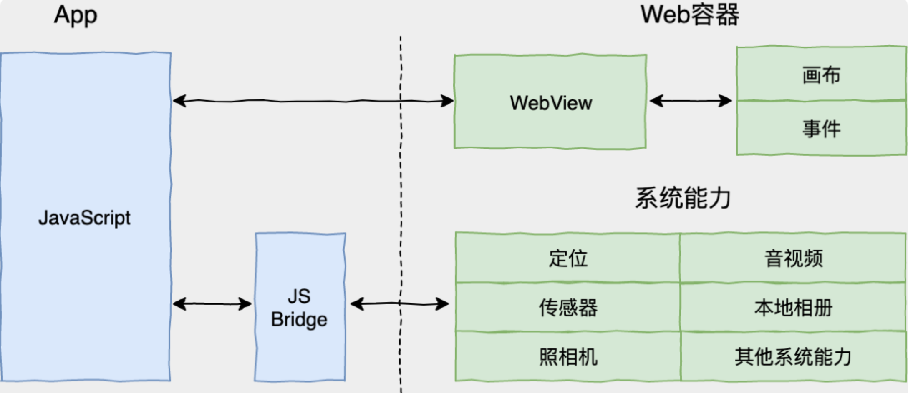
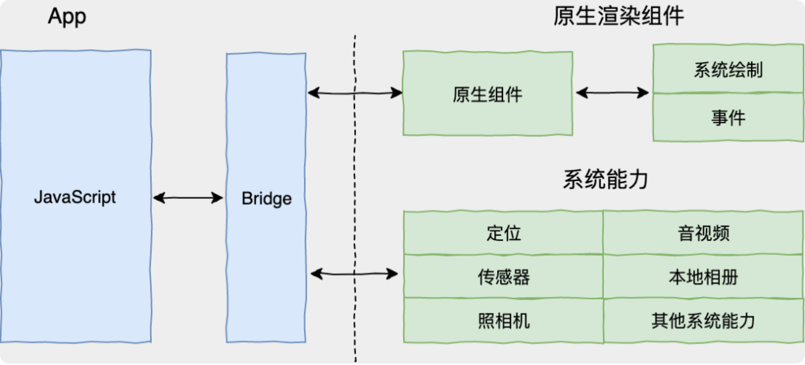
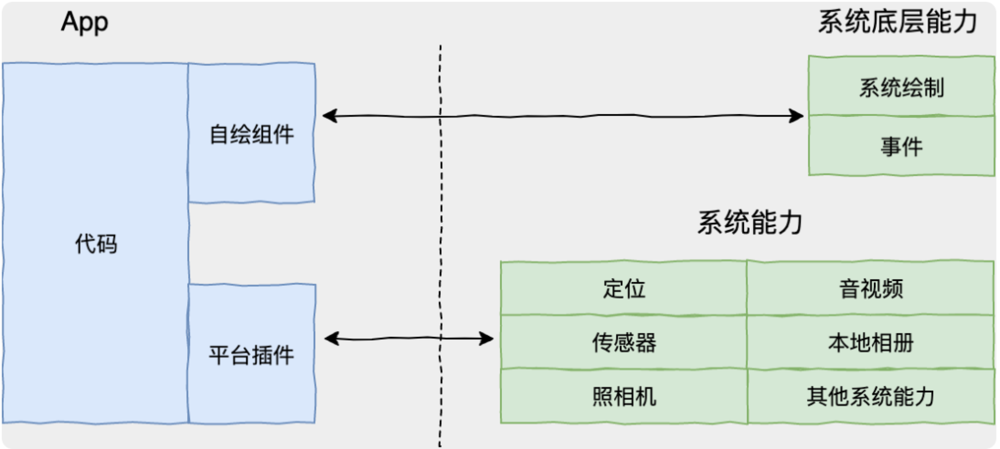
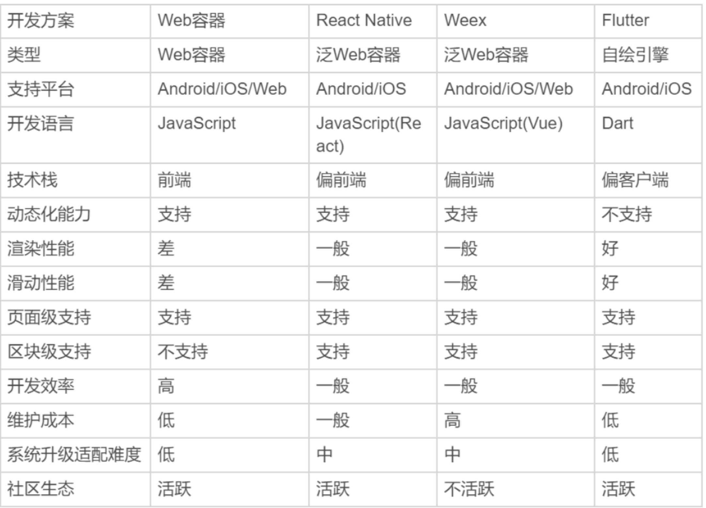
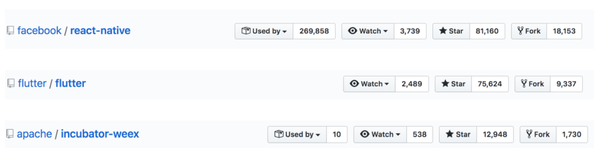
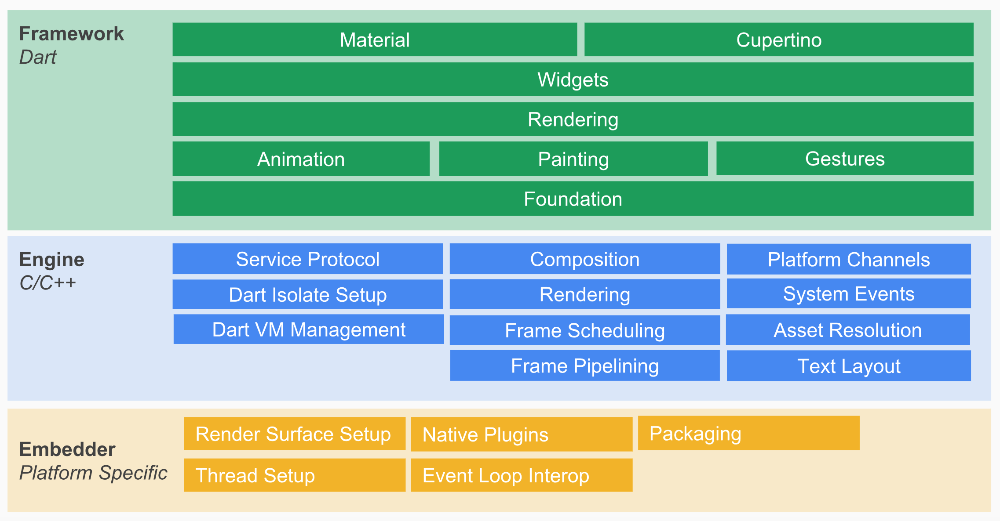
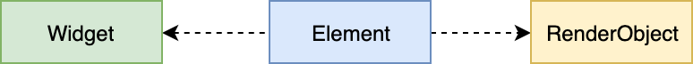
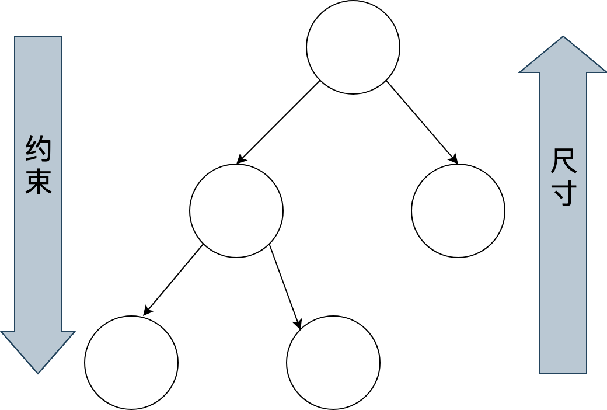
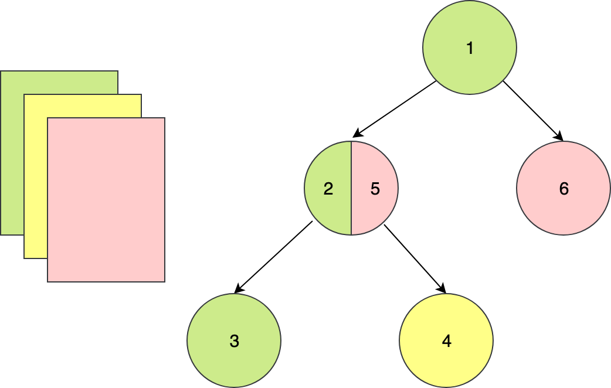
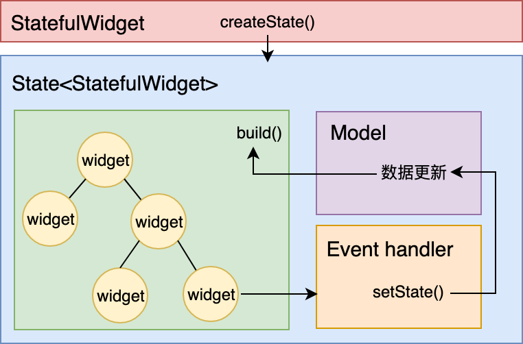

# Flutter从0到0.1

## 一、移动端跨平台开发方案的演进

### 移动端跨平台开发方案的演进

- Web 容器时代：基于 Web 相关技术通过浏览器组件来实现界面及功能，典型的框架包括 PhoneGap、Ionic 和微信小程序。



- 泛 Web 容器时代：采用类 Web 标准进行开发，但在运行时把绘制和渲染交由原生系统接管的技术，代表框架有 React Native、Weex 和快应用。



- 自绘引擎时代：自带渲染引擎，客户端仅提供一块画布即可获得从业务逻辑到功能呈现的多端高度一致的渲染体验。Flutter，是为数不多的代表。



### 主流跨平台框架对比



### 热门框架热度对比（截止到19年9月23日数据）



### Flutter发展历程

	- 2017.5 / Aplpha (v0.0.6)
	- 2018.2 / Beta 1
	- 2018.5 / Beta 3
	- 2018.6 / Preview
	- 2018.12 / Flutter Live with 1.0.0
	- 2019.5 / Flutter 1.5 (Flutter for Web 正式开启了 Flutter 的全平台 UI 框架之路)
	- 2019.9 / Flutter 1.9（web支持已经合并到flutter 的主repo）

## 二、Flutter简介

Flutter 是 Google 开源的新一代跨平台 UI 框架。不同于其他我们熟知的移动端跨平台方案，Flutter 更像游戏引擎，因为 Flutter 有自己的渲染引擎：我们在 Flutter 上写了界面后，Flutter 会在自己的 canvas 上渲染，移动端不负责绘制。

### 优势

1. Beautiful - Flutter 允许你控制屏幕上的每一寸像素，这让「设计」不用再对「实现」妥协；

2. Fast - 一个应用不卡顿的标准是什么，你可能会说 16ms 抑或是 60fps，这对桌面端应用或者移动端应用来说已足够，但当面对广阔的 AR/VR 领域，60fps 仍然会成为使人脑产生眩晕的瓶颈，而 Flutter 的目标远不止 60fps；借助 Dart 支持的 AOT 编译以及 Skia 的绘制，Flutter 可以运行的很快；

3. Productive - 前端开发可能已经习惯的开发中 hot reload 模式，但这一特性在移动开发中还算是个新鲜事。Flutter 提供有状态的 hot reload 开发模式，并允许一套代码运行于多端；其他的，再比如开发采用 JIT 编译与发布的 AOT 编译，都使得开发者在开发应用时可以更加高效； 我们可以看看Hot reload 是什么效果：https://flutterchina.club/hot-reload/

	PS：JIT，即Just-in-time,动态(即时)编译，边运行边编译；AOT，Ahead Of Time，指运行前编译。在开发期使用 JIT 编译，可以缩短产品的开发周期。Flutter 最受欢迎的功能之一热重载，正是基于此特性。而在发布期使用 AOT，就不需要像 React Native那样在跨平台 JavaScript 代码和原生代码之间建立低效的方法调用映射关系。所以说，Dart 具有运行速度快、执行性能好的特点。

4. Open - Dart / Skia / Flutter (Framework)，这些都是开源的，Flutter 与 Dart 团队也对包括 Web 在内的多种技术持开放态度，只要是优秀的他们都愿意借鉴吸收。而在生态建设上，Flutter 回应 GitHub Issue 的速度更是让人惊叹，因为是真的快（closed 状态的 issue 平均解决时间为 0.29天）；

### Show Me The Code

打开编辑器，创建新项目

## 三、Dart简介

Dart 是 Google 开发的计算机编程语言，可以用于 移动端、PC 端、WEB、服务器的开发，是全栈式编程语言。

### Dart 语法

[Dart基础语法](./Dart基础语法.md)

### 语言特性

- 单进程异步事件模型；
- 强类型，可以类型推断；
- DartVM，具有极高的运行效率和优秀的代码运行优化
- 独特的隔离区( Isolate )，可以实现多线程；
- 面向对象编程，一切数据类型均派生自 Object ；
- 运算符重载，泛型支持；
- 强大的 Future 和 Stream 模型,可以简单实现高效的代码；
- Minix 特性，可以更好的实现方法复用；
- 全平台语言，可以很好的胜任移动和前后端的开发。
- 在语法上，Dart 提供了很多便捷的操作，可以明显减少代码量。比如字符连接，可以直接 "my name is $name, age is $age"，无需+号拼接，也无需做类型转换。

## 四、Flutter 框架


### Flutter = Dart & C++ & Skia 



Flutter 架构采用分层设计，从下到上分为三层，依次为：Embedder、Engine、Framework。

- Embedder 是操作系统适配层，实现了渲染 Surface 设置，线程设置，以及平台插件等平台相关特性的适配。从这里我们可以看到，Flutter 平台相关特性并不多，这就使得从框架层面保持跨端一致性的成本相对较低。

- Engine 层主要包含 Skia、Dart 和 Text，实现了 Flutter 的渲染引擎、文字排版、事件处理和 Dart 运行时等功能。Skia 和 Text 为上层接口提供了调用底层渲染和排版的能力，Dart 则为 Flutter提供了运行时调用 Dart 和渲染引擎的能力。而 Engine 层的作用，则是将它们组合起来，从它们生成的的数据中实现视图渲染。

- Framework 层则是一个用 Dart 实现的 UI SDK，包含了动画、图形绘制和手势识别等功能。为了在绘制控件等固定样式的图形时提供更直观、更方便的接口，Flutter 还基于这些基础能力，根据 Material和 Cupertino 两种视觉设计风格封装了一套 UI 组件库。我们在开发 Flutter 的时候，可以直接使用这些组件库。

### Skia

Skia 是一款用 C++ 开发的、性能彪悍的 2D 图像引擎，被广泛应用在 Chrome 和 Android 等核心产品上。 底层渲染能力统一了，上层开发接口和功能体验也就随即统一了，开发者再也不用操心平台相关的渲染特性了。也就是说，Skia 保证了同一套代码调用在 Android 和 iOS平台上的渲染效果是完全一致的。

### 渲染原理

页面中的各界面元素（Widget）以树的形式组织，即控件树。Flutter 通过控件树中的每个控件创建不同类型的渲染对象树在 Flutter 的展示过程分为四个阶段：布局、绘制、合成和渲染。



- Widget 是 Flutter 世界里对视图的一种结构化描，你可以把它看作是前端中的“控件”或“组件”。Widget 是控件实现的基本逻辑单位，里面存储的是有关视图渲染的配置信息，包括布局、渲染属性、事件响应信息等。

- Element 是 Widget 的一个实例化对象，它承载了了视图构建的上下文数据，是连接结构化的配置信息到完成最终渲染的桥梁。Element 树这一层将 Widget 树的变化（类似 React 虚拟 DOM diff）做了抽象，可以只将真正需要修改的部分同步到真实的 RenderObject 树中，最大程度降低对真实渲染视图的修改，提高渲染效率，而不是销毁整个渲染视图树重建。

- RenderObject 是主要负责实现视图渲染的对象。布局和绘制在 RenderObject 中完成的。Flutter 采用深度优先机制遍历渲染对象树，确定树中各个对象的位置和尺寸，并把它们绘制到不同的图层上。绘制完毕后，合成和渲染的工作则交给 Skia 搞定。

### 渲染流程

1. 布局
    
    Flutter 采用深度优先机制遍历渲染对象树，决定渲染对象树中各渲染对象在屏幕上的位置和尺寸。在布局过程中，渲染对象树中的每个渲染对象都会接收父对象的布局约束参数，决定自己的大小，然后父对象按照控件逻辑决定各个子对象的位置，完成布局过程。

	
	
	
2. 绘制

	布局完成后，渲染对象树中的每个节点都有了明确的尺寸和位置。Flutter 会把所有的渲染对象绘制到不同的图层上。与布局过程一样，绘制过程也是深度优先遍历，而且总是先绘制自身再绘制子节点。

	
	
	
3. 合成和渲染

	终端设备的页面越来越复杂，因此 Flutter 的渲染树层级通常很多，直接交付给渲染引擎进行多图层渲染，所以还需要先进行一次图层合成，即将所有的图层根据大小、层级、透明度等规则计算出最终的显示效果，将相同的图层归类合并，简化渲染树，提高渲染效率。 合并完成后，Flutter 会将几何图层数据交由 Skia引擎加工成二维图像数据，最终交由 GPU 进行渲染，完成界面的展示。
	
## 五、上手开发

### Widget is God

Widget 是 Flutter 功能的抽象描述，是视图的配置信息，同样也是数据的映射，是 Flutter 开发框架中最基本的概念。前端框架中常见的名词，比如视图（View）、视图控制器（View Controller）、活动（Activity）、应用（Application）、布局（Layout）等，在 Flutter 中都是 Widget。 Flutter 的核心设计思想便是“一切皆 Widget”。 我们可以一起看看Flutter提供了哪些可以用的Widget： https://flutter.cn/docs/development/ui/widgets

### UI编程范式

Flutter 的视图开发是声明式的，其核心设计思想就是将视图和数据分离，这与 React 的设计思路完全一致。命令式编程强调精确控制过程细节，而声明式编程强调通过意图输出结果整体。

当需要变更界面的文案时，我们只要改变数据集中的文案数据，并通知 Flutter 框架触发 Widget 的重新渲染即可。这样一来，开发者将无需再精确关注 UI 编程中的各个过程细节，只要维护好数据集即可。比起命令式的视图开发方式需要挨个设置不同组件（Widget）的视觉属性，这种方式要便捷得多。

命令式编程

```
TextView textView = (TextView) findViewById(R.id.txt);
textView.setText("Hello World");
```

声明式编程

```
class Counter extends StatefulWidget {

  @override
  _CounterState createState() => new _CounterState();
}

class _CounterState extends State<Counter> {
  int _counter = 0;

  void _increment() {
    setState(() {
      _counter++;
    });
  }

  @override
  Widget build(BuildContext context) {
   
    return new Row(
      children: <Widget>[
        new RaisedButton(
          onPressed: _increment,
          child: new Text('Increment'),
        ),
        new Text('Count: $_counter'),
      ],
    );
  }
}
```

### State

Flutter根据初始化之后Widget是否需要变化分为了StatelessWidget 和 StatefulWidget。

- StatefulWidget 是 UI 可以变化的 Widget。
- StatelessWidget 是没有 State（状态）的 Widget，当 Widget 在运行时不需要改变时，就用 StatelessWidget。

StatelessWidget的实现

```
import 'package:flutter/material.dart';

void main() => runApp(MyApp("Hello World"));

class MyApp extends StatelessWidget {
  // This widget is the root of your application.
  final String content;

  MyApp(this.content);
  
  @override
  Widget build(BuildContext context) {
    return MaterialApp(
      title: 'Flutter Demo',
      theme: ThemeData(
        primarySwatch: Colors.blue,
      ),
      home: Scaffold(
        body: Center(
          child: Text(content),
        ),
      )
    );
  }
}
```

StatefulWidget的实现

```
import 'package:flutter/material.dart';

void main() => runApp(MyApp("Hello World"));

class MyApp extends StatefulWidget {
  // This widget is the root of your application.

  String content;

  MyApp(this.content);

  @override
  State<StatefulWidget> createState() {
 
    return MyAppState();
  }
}

class MyAppState extends State<MyApp> {

  bool isShowText =true;

  void increment(){
    setState(() {
      widget.content += "d";
    });
  }

  @override
  Widget build(BuildContext context) {
    return MaterialApp(
        title: 'Flutter Demo',
        theme: ThemeData(
          primarySwatch: Colors.blue,
        ),
        home: Scaffold(
          appBar: AppBar(title: Text("Widget -- StatefulWidget及State"),),
          body: Center(
              child: GestureDetector(
                child: isShowText? Text(widget.content) :null,
                onTap: increment,
              )
          ),
        )
    );
  }
}
```



对于 UI 框架而言，同样的展示效果一般可以通过多种控件实现。从定义来看，StatefulWidget 仿佛是万能的，替代 StatelessWidget 看起来合情合理。于是 StatefulWidget 的滥用，也容易因此变得顺顺理成章，难以避免。

但事实是，StatefulWidget 的滥用会直接影响 Flutter 应用的渲染性能。Widget 是不可变的，更新则意味着销毁 + 重建（build）。StatelessWidget 是静态的，一旦创建则无需更新；而对于 StatefulWidget 来说，在 State 类中调用 setState 方法更新数据，会触发视图的销毁和重建，也将间接地触发其每个子 Widget 的销毁和重建。避免无谓的 StatefulWidget 使用，是提高 Flutter 应用渲染性能最简单也是最直接的手段。

### 通信 Flutter <--> Flutter

- setstate

```

```