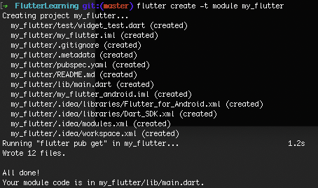

#多种混合方案的探讨

#### Flutter官方的混编方案
[混编wiki](https://github.com/flutter/flutter/wiki/Add-Flutter-to-existing-apps)

1. 创建 **module**，如果创建不成功，切换flutter到稳定版本

	```
	flutter create -t module my_flutter
	```
	
	
	
2. 创建 Xcode 项目中的 **Config** 文件，引向flutter module
 
	新建 Config 目录，管理 Xcode 工程的配置衔接文件，分别创建 Flutter.xcconfig 、Debug.xcconfig、Release.xcconfig 三个配置文件；其中Flutter.xcconfig 是指向外目录flutter module的Generated.xcconfig 文件路径引用文件，其他两个代表Xcode的环境配置文件。
	
	

3. 三个文件的引用内容
	
	In **Flutter.xcconfig**:
	
	```
	#include "../../my_flutter/.ios/Flutter/Generated.xcconfig"
ENABLE_BITCODE=NO
	```
	
	In **Debug.xcconfig**:
	
	```
	#include "Flutter.xcconfig"
	```
	
	In **Release.xcconfig**:
	
	```
	#include "Flutter.xcconfig"
	FLUTTER_BUILD_MODE=release
	```
	
4. Xcode project **环境配置选择**

	
	
5. 引入 **xcode-backend.sh**

	在iOS工程里添加运行脚本 **"$FLUTTER_ROOT/packages/flutter_tools/bin/xcode_backend.sh" build**，并且确保 **Run Script** 这一行在 **"Target dependencies"** 或者 **"Check Pods Manifest.lock"** 后面。
	
	
	
6. 添加 flutter 编译产物
	
	右键项目 - **Add Files to 'xxx'** 【Options先选Create groups】，选择Flutter目录
	
	
	
	但是flutter_assets 并不能使用Create groups 的方式添加，只能使用Creat folder references 的方式添加进Xcode项目内，否则跳转flutter会页面渲染失败（页面空白）。

	应该删除flutter_assets，文件夹再Add Files to 'xxx'，选择Creat folder references ；最终如下图
	
	
	
	将iOS工程目录下的Flutter文件夹添加到工程，然后确保文件夹下的两个framework添加到Embeded Binaries里
	
#### 项目使用pod管理情况

##### 一、旧项目没使用pod管理，混编后又想pod管理

- 1、先删除Xcode工程项目中的Run Script
- 2、pod init
- 3、在生成的pod file文件写你要增加的第三方框架，如pod 'AFNetworking’- 
- 4、pod install
- 5、（使用.xcworkspace打开项目）重新配置Run Script
- 6、修改Debug.xcconfig 、Release。xcconfig
	都需要增加一行pod config文件引用：（自己查看自己的Pods目录文件路径, release就使用.release.xcconfig）
	
	```
	#include "Flutter.xcconfig"
	// 下面为pod引入需要增加的一行
	#include "Pods/Target Support Files/Pods-iOSBridgeFlutterDemo/Pods-	iOSBridgeFlutterDemo.debug.xcconfig"

	```
- 7、项目重新编译，Success

##### 二、如果旧项目已经使用pod管理

- 如果项目ignore Pods文件夹， 则走一方法中的1、4、5、6、7步骤
- 如果项目Pods文件夹存在，则走一方法中的6、7步骤

#### 总结官方方案的优缺点

##### （1）优点：

- 不需要每次 Run 起来之后，先进行 同步flutter代码（组件化Flutter后，因为组件化后flutter代码已经变为framework，所以每次进来需要先热更新同步代码）
- 不需要单独搞一个组件进行集成，管理组件的版本，发布等。

##### （2）缺点：

- 会非常耦合工程，需要修改工程配置，添加 BUILD PHASE 调用 flutter 中 xcode_backend.sh 脚本 去编译 Flutter。

- 如果使用pod管理，那么还需修改xcconfig配置。

- 因为需要调用 Flutter 的编译脚本，所以这种方式集成后，团队内所有组员电脑和打包机，都必须安装Flutter环境才能编译成功。

#### 优雅的 Flutter 组件化混编方案

##### （1）优点：

- 不需修改 原有 xcconfig 配置。
- 不需要添加 Run Script 脚本。
- 运行不需要依赖 Flutter 环境。

##### （2）缺点：

- 需要单独管理一个 flutter私有索引库。
- 开发加载 Flutter 页面 首次需要热更新 进行刷新同步 Flutter 代码。

##### （3）混编方案 实现核心思想：

- 通过查看 Flutter 编译脚本xcode_backend.sh 和 测试单独引入编译产物，发现其实 只要拥有 Flutter 的编译产物，项目就可以接入 Flutter 的功能。
- 所以说只要把Flutter编译好的产物，放在工程里，那么就无需配置每次调用 xcode_backend.sh 脚本，也无需强耦合Flutter环境，不需要所有组员安装Flutter环境，只需要有发布开发需求的同学进行安装即可。

##### （4）Flutter 核心编译产物：
- App.framework：dart业务源码相关文件，在 Debug 模式下就是一个很小的空壳，在 Release 模式下包含全部业务逻辑。
- flutter_assets：Flutter依赖的静态资源，如字体，图片等。
- Flutter.framework：Flutter库和引擎。

概览


1. Git仓库存放

	主要分为3个仓库，分别存放Native项目、Flutter 工程源码、Flutter 编译产物私有pod库。
flutter 工程创建，使用 flutter create -t module my_flutter 命令

	

2. 混编方案说明
	
	根据 只要拥有 Flutter 的编译产物，项目就可以接入 Flutter 的功能 的核心思想，我们如果进行组件化Flutter混编，那么大概思路是：
	
	- (1) 在 flutter 项目目录下，执行 flutter build ios 针对 Flutter 项目进行编译打包，生成 Flutter 编译产物。
	
		Flutter 的产物分为两种模式，一个是 Debug 模式，采用 JIT（Just In Time）的方式，好处是可以支持热更新，方便调试,，但是性能比较慢。
另一种是 AOT（Ahead Of Time）release 模式，好处是性能比较好。

		通过 flutter build ios --debug 可打包出 Debug 下的 Flutter 编译产物。
		
		
		
	- (2) 针对编译产物，制作 Flutter SDK 私有库， podspec 指定 App.framework、engine、flutter_assets 路径。
	
		
		
	- (3) 上传 Flutter SDK 私有库项目到云端私有pod索引库。
	
		```
		source 'https://github.com/xl19880619/XLFlutterSDK.git'
		```
		
	- (4) iOS 主项目指定 Podfile ，拉取云端Flutter私有库到本地。

		

3. 最后效果,如下图，可以看到最终工程只引用了一个私有 pod 库。

	
	